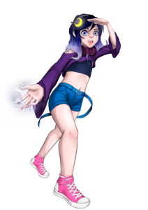

# Luna

Documentação em portguês (pt-br) :brazil:

Documentation in english (en) :us:

# Documentação em portguês (pt-br) :brazil:

## Sobre
A Luna é chatbot para a plataforma [Twitch](https://www.twitch.tv/), que irá ajudar você em sua stream interagindo e moderando o chat.
O projeto da Luna vem sendo desenvolvido no meu tempo livre, por causa disso pode levar um tempo para que uma função nova seja implementada, tentarei corrigir os eventuais bugs o mais rápido possível.

## Dica
Para que nem uma mensagem da Luna seja bloqueada pela twitch ou por outros bots que você possa possuir e também para ela conseguir executar todos os comandos sem problemas coloque ela como moderadora, caso não estejá confortavel em colocala como moderadora recomendamos que atribua o cargo de vip.

## AVISO IMPORTANTE
Caso você peça para a Luna deixar o seu canal todos os seus dados(comandos, mensagens, configurações e etc.) serão excluídos imediatamente e permanentimente então por favor tenha certeza que deseja remove-lá do seu canal.

## Comandos

### Comandos do bot
Esses comandos só serão reconhecidos se enviados apenas no chat da [Luna](https://www.twitch.tv/lunachan250)

| Comando                     | Saída                                                     |
| :-------------------------- | :-------------------------------------------------------- |
| !join                       | O bot entra no canal                                      |
| !leave                      | O bot Sai do canal                                        |
| !enableban                  | Será ativado a função de banimento automático             |
| !disableban                 | Será desativado a função de banimento automático          |

#### Banimento automático
Essa função consiste em banir usuários que possuem histórico de bans registrado na sua conta por diversos motivos, toda vez que um usuário é banido em um canal que a Luna esteja presente ela irá registrar em seu banco de dados o banimento daquele usuário. Após ele acumular um determinado número de banimentos ele será considerado um usuário nocivo e caso a opção de autoban esteja ativa em seu canal ele será banido automaticamente do seu canal.

### Comandos para o Streamer
Esses comandos só serão reconhecidos se o próprio Streamer enviar no seu próprio canal.

**IMPORTANTE:** Nos parênteses () o conteúdo deles devem ser substituído pelo conteúdo que você quiser e os [] devem estar presente no comando final caso contrário um erro será gerado ex:
!addtm seguir[30]=Não esqueçam de dar o follow!!!

| Comando        | Exemplo                                                                    | Saída                                                  |
| :------------- | :------------------------------------------------------------------------- | :----------------------------------------------------- |
| !add           | !add (nome do comando)=(O que o bot irá responder)                          | Adiciona um comando                                   |
| !remove        | !remove (nome do comando)                                                   | Remove o comando                                       |
| !reset         | !reset (nome do comando) ou !reset (nome do comando)=(número)                | Se o camando possuir um contador será resetado para 0 ou número desejado            |
| !createlottery | !createlottery (nome do sorteio) [(quantidade de ganhadores)]              | Cria um sorteio                                        |
| !deletelottery | !deletelottery (nome do sorteio)                                           | Apaga o sorteio                                        |
| !lotterywinner | !lotterywinner (nome do sorteio)                                           | Pega o ganhador do sorteio                            |
| !addtm         | !addtm (nome da mensagem)[(tempo em minutos)]=(Mensagem que será exibida)  | Cria uma mensagem que será enviada de tempos em tempos |
| !rmtm          | !rmtm (nome da mensagem)                                                   | Apaga a mensagem criada                                |

**OBS:** não esqueça de apagar os sorteios após finalizado, os sorteios tem o tempo maximo de duração de 30 dias após isso serão finalizados e apagados automaticamente e não gerando um ganhador.

### Comandos Globais
Esses comandos serão reconhecidos em qualquer chat.

| Comado                    | Saída                                            |
| :------------------------ | :----------------------------------------------- |
| !list                     | Mostra todos os comandos disponíveis para o chat |
| !ticket (nome do sorteio) | Usado para entrar em um sorteio aberto no canal  |

**OBS**: se você criar um comando com o mesmo nome em seu canal os comandos globais serão substituídos pelo comando cadastrado no seu canal e perderão seu função, mas apenas em seu canal.

### Formatação do Texto nos comandos
Na hora da criação dos comandos deve ser usada a sintaxe abaixo para poder ter interações com o chat.

| Comando   | exemplo                                          | Saída                                                  | OBS                                           |
| :-------- | :----------------------------------------------- | :----------------------------------------------------- | :-------------------------------------------- |
| {user}    |                                                  | Usuário que mandou a mensagem                          |                                               |
| {user2}   |                                                  | Usuário marcado no comando                     |                                               |
| {rnum}[x] | a chance é de {rnum}[insira o número que quiser] | Número aleatório entre 0 há o número que você escolheu | o número não pode ser maior que 2,100,000,000 |
| {count}   |                                                  | inicia uma contagem começando em 0                     |                                               |

## Contato
Caso você tenha ideia de alguma função que gostaria que fosse implementada ou Caso tenha uma dúvida, necessite de ajuda ou tenha achado um bug por favor entre em contato por DM no [Twitter](https://twitter.com/LunaChan250),  ou wisper para a conta da Luna na [twitch](https://www.twitch.tv/lunachan250).

# Documentation in english (en) :us:

## About

## Tips

## Alert

## Commands

## Contact
